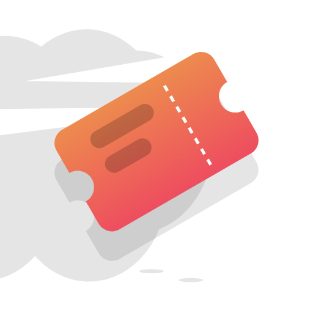

# QTáRolando?

Este é um app desenvolvido, em Flutter e Dart, para o projeto de Extensão Apps4Society do Campus IV - UFPB, em Rio Tinto, cujo o objetivo é oferecer, de forma simples e fácil, tanto a visualização quanto as informações de eventos, inicialmente com o foco aos relacionados a UFPB, no estado da Paraíba.

## Baixar última versão do APK:
Clique no icone abaixo para baixar:<br><br>
<a href="https://drive.google.com/file/d/1b3hGxYOGe9XudJNIPAyNUHcLvaKuoe6r/view">
</a> 


### QTáRolando? Screenshots

<table>
  <tr>
    <td>Homepage</td>
    <td>Search</td>
    <td>Filter</td>
  </tr>
  <tr>
    <td></td>
    <td></td>
    <td></td>
  </tr>
  <tr>
    <td>Share</td>
    <td>Event Details</td>
    <td>Dark Theme</td>
  </tr>
  <tr>
    <td></td>
    <td></td>
    <td></td>
  </tr>
 </table>

## Pré Requisitos
### Flutter v2.10.1 ou superior
Como iniciar com o Flutter: https://flutter.dev/docs/get-started/install

### Plugins/Extensões
Embora os plugins, que serão listados abaixo, não sejam necessários para a execução do projeto, auxiliam muito na produtividade durante o desenvolvimento do mesmo.

OBS: Tanto os plugins quanto o projeto podem ser encontrados/desenvolvido no Android Studio ou no Visual Studio Code.

#### Dart
O Dart  fornece ao VS Code ou Android Studio, suporte para a linguagem de programação Dart e  ferramentas para editar, refatorar, executar e recarregar aplicativos móveis Flutter e aplicativos web AngularDart com eficácia.
#### Flutter
Esta extensão do VS Code ou Android Studio adiciona suporte para edição, refatoração, execução e recarga de aplicativos móveis Flutter de maneira eficaz, bem como suporte para a linguagem de programação Dart.

## Iniciando o Projeto
Após baixar/clonar o projeto abra a pasta do projeto em seu ambiente de desenvolvimento (Android Studio ou no Visual Studio Code), no console ou terminal do ambiente execute os seguintes comandos:

### Comando para baixar todas as dependências do projeto:
```{sh}
flutter pub get
```
#### Observação
Antes de iniciar o aplicativo, certifique-se de ter criado na raís do projeto (Ao lado dos arquivos pubspec.yaml e README.md) um arquivo com esse nome:
```
.env
```
Dentro desse aplicativo crie essa váriavel com o link para a QTaRolandoAPI
```
#Substitua {LinkDaAPIQTaRolandoAPI} pelo link da API QTaRolandoAPI
API_URL={LinkDaAPIQTaRolandoAPI}
```

### Com um dispositivo conectado ou emulador aberto, execute o seguinte comando:
```{sh}
flutter run
```
Pronto o projeto já estará executando, let's code!.
